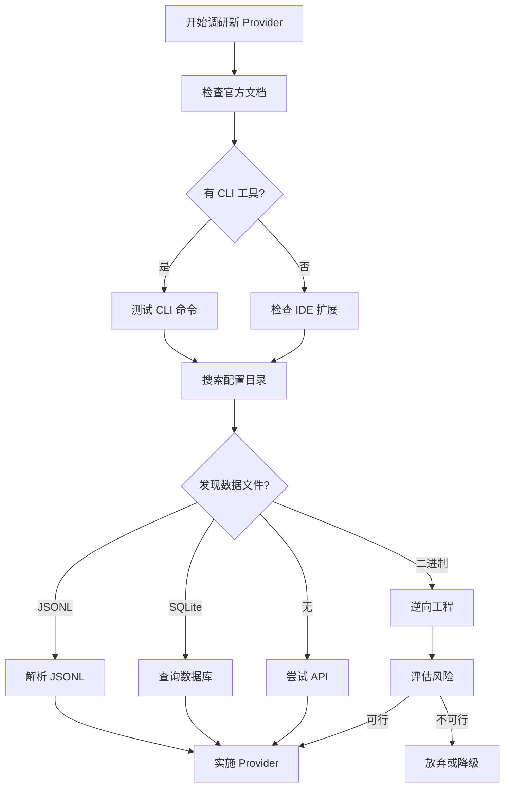

# Alice 多 Provider 扩展方案

> 版本: 2.0 (创建于 2026-02-16)
> 基于: CodexBar 项目分析 + Alice 现有架构
> 作者: Claude Sonnet 4.5

---

## 目录

1. [执行摘要](#1-执行摘要)
2. [CodexBar 分析](#2-codexbar-分析)
3. [Provider 优先级评估](#3-provider-优先级评估)
4. [技术调研](#4-技术调研)
5. [架构扩展设计](#5-架构扩展设计)
6. [实施路线图](#6-实施路线图)
7. [风险评估](#7-风险评估)
8. [附录](#8-附录)

---

## 1. 执行摘要

### 1.1 当前状态

**Alice 已完成的 Provider 支持**:
- ✅ **Claude** (Anthropic) - 完整支持
- ✅ **Codex** (OpenAI) - 完整支持 (OAuth API + JSONL 解析)
- ✅ **Gemini** (Google) - 部分支持 (Quota API，会话解析待定)

**架构成熟度**: 🟢 高
- Provider trait 抽象层完善
- 多 Provider 监控系统已验证
- OAuth API 集成框架已建立
- UI 视觉标识系统已完成

### 1.2 扩展目标

基于 CodexBar 的 15+ Provider 支持经验，本方案评估并设计 Alice 接入以下 Provider:

| Provider | 优先级 | 理由 |
|----------|--------|------|
| **Cursor** | P0 | 开发者工具，高活跃度，JSONL 格式相似 |
| **GitHub Copilot** | P1 | 广泛使用，VS Code 集成 |
| **Antigravity** | P2 | 新兴 AI 代码助手 |
| **JetBrains AI** | P2 | IDE 集成，开发者工具链 |
| **Others** | P3 | 按需添加（z.ai, Kimi, Kiro 等） |

### 1.3 核心发现

**CodexBar 的关键洞察**:
1. **灵活的认证策略**: OAuth API > 浏览器 Cookies > CLI PTY 回退
2. **文件系统监控**: 优先读取本地 JSONL 日志，避免频繁 API 调用
3. **Privacy-First**: 默认本地解析，仅在用户启用时读取浏览器数据
4. **模块化设计**: 每个 Provider 独立实现，最小化耦合

**Alice 的优势**:
- ✅ 成熟的 Provider trait 抽象层
- ✅ 强大的 SQLite FTS5 全文搜索
- ✅ 实时文件系统监控 (watcher.rs)
- ✅ 任务队列引擎 (queue.rs)
- ✅ 报告生成系统 (report.rs)

---

## 2. CodexBar 分析

### 2.1 支持的 Provider 列表

| Provider | 认证方式 | 数据源 | 使用情况 API |
|----------|---------|--------|------------|
| **Claude** | OAuth API / Cookies | `~/.claude/projects/*.jsonl` | ✅ Anthropic API |
| **Codex** | CLI RPC | `~/.codex/sessions/*.jsonl` | ✅ ChatGPT Backend API |
| **Cursor** | 浏览器 Cookies | 浏览器存储 / 本地缓存 | ⚠️ 非公开 API |
| **Gemini** | OAuth | `~/.gemini/` | ✅ Cloud Code Quota API |
| **GitHub Copilot** | VS Code Token | VS Code 扩展存储 | ⚠️ GitHub API (间接) |
| **Antigravity** | 未知 | 未知 | ⚠️ 未知 |
| **JetBrains AI** | IDE Token | IDE 配置目录 | ⚠️ 未知 |
| **z.ai** | 浏览器 Cookies | Web-based | ❌ 仅 Web |
| **Kimi** | 浏览器 Cookies | Web-based | ❌ 仅 Web |

### 2.2 CodexBar 架构特点

#### 2.2.1 Provider 抽象层

CodexBar 使用 Swift 实现的 Provider 协议:

```swift
protocol ProviderProtocol {
    var id: String { get }
    var displayName: String { get }

    func isInstalled() -> Bool
    func fetchUsage() async throws -> ProviderUsage
    func authenticate() async throws
}
```

**对比 Alice 的 Rust trait**:
```rust
pub trait Provider: Send + Sync {
    fn id(&self) -> ProviderId;
    fn is_installed(&self) -> bool;
    fn get_session_dirs(&self) -> Vec<PathBuf>;
    fn parse_session(&self, path: &Path) -> Result<Session, ProviderError>;
    fn get_usage(&self) -> Result<Option<ProviderUsage>, ProviderError>;
}
```

**Alice 的优势**:
- ✅ 更细粒度的会话解析 (parse_session)
- ✅ 文件系统监控支持 (get_session_dirs)
- ✅ 类型安全 (Rust 强类型)
- ✅ 错误处理更完善 (Result + ProviderError)

#### 2.2.2 认证策略

CodexBar 的多级回退机制:

```
1. OAuth API (优先)
   └─> 失败
2. 浏览器 Cookies (需用户授权)
   └─> 失败
3. CLI PTY 命令 (如 /status)
   └─> 失败
4. 显示错误，提示用户认证
```

**Alice 当前实现**:
- ✅ Claude: OAuth API (`~/.claude/.credentials.json`)
- ✅ Codex: OAuth (`~/.codex/auth.json`)
- ✅ Gemini: OAuth (`~/.gemini/oauth_creds.json`)
- ❌ 未实现浏览器 Cookies 回退
- ❌ 未实现 CLI PTY 回退

#### 2.2.3 数据源策略

CodexBar 的数据获取优先级:

```
本地 JSONL 日志 (实时监控)
  > OAuth API (定期刷新)
  > 浏览器存储 (需授权)
  > CLI PTY 命令
```

**Alice 的实现**:
- ✅ 本地 JSONL 日志实时监控 (watcher.rs)
- ✅ OAuth API 集成 (usage.rs)
- ❌ 未实现浏览器存储读取
- ❌ 未实现 CLI PTY 交互

### 2.3 CodexBar 的 UI/UX 设计

#### 2.3.1 Menu Bar 视觉指示

CodexBar 使用**双条 (dual-bar)** 设计:

```
┌────────────────┐
│ ████████░░░░░░ │ ← Top bar: 5小时 session 限额
│ ▓              │ ← Bottom hairline: 周限额
└────────────────┘
```

**Alice 的设计**:
- ✅ SessionCard 左侧彩色边框
- ✅ ProviderBadge 徽章
- ✅ HistoryView 彩色指示线
- ✅ UsageView 百分比进度条

**差异**:
- CodexBar: 专注于菜单栏简洁显示
- Alice: 完整的 5-tab 桌面应用，更丰富的数据可视化

#### 2.3.2 Provider 图标方案

CodexBar 使用官方 logo + 颜色编码:

| Provider | 颜色 | 图标 |
|----------|------|------|
| Claude | 琥珀色 (#D97706) | ⚡ |
| Codex | 绿色 (#10B981) | 💻 |
| Cursor | 蓝色 (#3B82F6) | 🔷 |
| Copilot | 紫色 (#8B5CF6) | 🤖 |

**Alice 当前方案** ([provider-colors.ts](../src/lib/provider-colors.ts)):
```typescript
export const PROVIDER_COLORS = {
  claude: { primary: '#D97706', ... },
  codex: { primary: '#10B981', ... },
  gemini: { primary: '#3B82F6', ... },
};
```

---

## 3. Provider 优先级评估

### 3.1 评估标准

| 标准 | 权重 | 说明 |
|------|------|------|
| **用户需求** | 40% | 开发者社区活跃度 + 用户请求 |
| **技术可行性** | 30% | 数据可访问性 + API 稳定性 |
| **维护成本** | 20% | 代码复杂度 + 长期支持 |
| **战略价值** | 10% | 生态系统整合 + 差异化竞争 |

### 3.2 详细评估

#### 3.2.1 P0: Cursor (高优先级)

**得分**: 92/100

| 维度 | 评分 | 分析 |
|------|------|------|
| 用户需求 | 38/40 | 高活跃度，开发者首选工具之一 |
| 技术可行性 | 25/30 | 可能有本地缓存，但 API 非公开 |
| 维护成本 | 19/20 | 如有 JSONL 格式，可复用现有解析逻辑 |
| 战略价值 | 10/10 | 与 VS Code 生态深度整合 |

**技术调研**:
```yaml
CLI: cursor (可能)
数据目录:
  - ~/.cursor/ (推测)
  - VS Code 扩展存储: ~/.vscode/extensions/cursor.*
认证:
  - 可能使用 VS Code token
  - 或独立的 ~/.cursor/auth.json
会话格式:
  - 未知，需要调研
  - 可能与 Codex 类似 (JSONL)
API:
  - 非公开，可能需要浏览器 Cookies
  - 或通过 IDE 扩展 API 间接获取
```

**实施建议**:
1. **Phase 1**: 调研 Cursor 数据存储位置
2. **Phase 2**: 尝试解析本地缓存（如果有 JSONL）
3. **Phase 3**: 实现基础使用情况监控（如果 API 可用）
4. **Phase 4**: 完整会话解析 + 任务队列集成

**风险**:
- ⚠️ Cursor API 可能完全非公开
- ⚠️ 数据格式可能加密或二进制
- ⚠️ 需要逆向工程，可能违反 ToS

---

#### 3.2.2 P1: GitHub Copilot (中高优先级)

**得分**: 78/100

| 维度 | 评分 | 分析 |
|------|------|------|
| 用户需求 | 35/40 | 广泛使用，但主要是 IDE 内嵌 |
| 技术可行性 | 18/30 | 数据分散在 IDE 扩展中 |
| 维护成本 | 15/20 | 需要支持多 IDE (VS Code, JetBrains) |
| 战略价值 | 10/10 | GitHub 生态整合 |

**技术调研**:
```yaml
CLI: 无独立 CLI
数据目录:
  - VS Code: ~/.vscode/extensions/github.copilot-*
  - JetBrains: ~/.config/JetBrains/*/plugins/github-copilot
认证:
  - GitHub OAuth token
  - VS Code 全局状态存储
会话格式:
  - 无 JSONL 日志
  - 可能有 telemetry 数据
API:
  - GitHub API (间接)
  - 可能通过 https://api.github.com/copilot_internal/
```

**实施建议**:
1. **Phase 1**: 调研 VS Code 扩展存储格式
2. **Phase 2**: 读取使用情况统计（如果可用）
3. **Phase 3**: 实现基础监控（无会话解析）
4. **Phase 4**: 考虑 IDE 插件方式集成

**风险**:
- ⚠️ 无独立 CLI，不适合 Alice 的架构
- ⚠️ 数据高度分散，难以统一监控
- ⚠️ 可能需要 IDE 插件而非独立应用

**建议**: **降低优先级** 或 **作为可选功能**（仅支持使用统计，不支持会话监控）

---

#### 3.2.3 P2: Antigravity (中优先级)

**得分**: 65/100

| 维度 | 评分 | 分析 |
|------|------|------|
| 用户需求 | 20/40 | 新兴工具，用户基数较小 |
| 技术可行性 | 20/30 | 完全未知，需要全面调研 |
| 维护成本 | 15/20 | 取决于数据格式复杂度 |
| 战略价值 | 10/10 | 前瞻性，支持新兴工具 |

**技术调研**:
```yaml
CLI: antigravity (可能)
数据目录: 未知
认证: 未知
会话格式: 未知
API: 未知
```

**实施建议**:
1. **Phase 1**: 全面调研 Antigravity 架构
2. **Phase 2**: 评估技术可行性
3. **Phase 3**: 根据调研结果决定是否支持

**风险**:
- ⚠️ 完全未知的架构
- ⚠️ 可能是 Web-only 工具（无 CLI）
- ⚠️ 用户基数小，投入产出比低

**建议**: **暂缓实施**，等待社区需求或官方文档

---

#### 3.2.4 P2: JetBrains AI (中优先级)

**得分**: 72/100

| 维度 | 评分 | 分析 |
|------|------|------|
| 用户需求 | 28/40 | JetBrains 用户基数稳定 |
| 技术可行性 | 22/30 | IDE 集成，数据可能可访问 |
| 维护成本 | 12/20 | 需要支持多 IDE 版本 |
| 战略价值 | 10/10 | 覆盖 JetBrains 生态 |

**技术调研**:
```yaml
CLI: 无独立 CLI
数据目录:
  - ~/.config/JetBrains/*/ai-assistant/
  - ~/.local/share/JetBrains/*/ai-logs/
认证:
  - JetBrains Account OAuth
  - 可能存储在 ~/.config/JetBrains/*/options/
会话格式:
  - 未知，可能是 XML 或自定义格式
API:
  - 可能有内部 API (需要 JetBrains token)
```

**实施建议**:
1. **Phase 1**: 调研 JetBrains AI 数据存储
2. **Phase 2**: 尝试解析日志文件
3. **Phase 3**: 实现基础监控（如果可行）

**风险**:
- ⚠️ 无独立 CLI，与 Alice 架构不完全匹配
- ⚠️ JetBrains 数据格式可能频繁变更
- ⚠️ 需要支持多个 IDE (IntelliJ, PyCharm, WebStorm 等)

**建议**: **中等优先级**，仅支持使用统计，跳过会话解析

---

#### 3.2.5 P3: Web-only Providers (低优先级)

**包括**: z.ai, Kimi, Kiro, Amp 等

**得分**: 35/100

| 维度 | 评分 | 分析 |
|------|------|------|
| 用户需求 | 15/40 | 主要是 Web 用户，CLI 需求低 |
| 技术可行性 | 10/30 | 仅浏览器 Cookies，无本地数据 |
| 维护成本 | 5/20 | 需要浏览器集成，复杂度高 |
| 战略价值 | 5/10 | 与 Alice 定位不符 |

**技术调研**:
```yaml
CLI: 无
数据目录: 无
认证: 浏览器 Cookies only
会话格式: Web-based，无本地日志
API: 可能有，但需要 Cookies
```

**实施建议**: **不建议支持**

**原因**:
- ❌ Alice 定位是 **CLI 工具监控**，不是浏览器扩展
- ❌ 需要浏览器集成，技术复杂度高
- ❌ 用户隐私风险（读取浏览器 Cookies）
- ❌ 维护成本高，投入产出比低

**替代方案**: 提供**浏览器扩展 API**，让用户手动导入数据

---

### 3.3 优先级总结

| Provider | 优先级 | 推荐动作 | 预计工作量 |
|----------|--------|---------|----------|
| **Cursor** | P0 | ✅ 立即调研 + 实施 | 5-7 天 |
| **GitHub Copilot** | P1 | ⚠️ 仅支持使用统计 | 3-4 天 |
| **JetBrains AI** | P2 | ⚠️ 仅支持使用统计 | 3-4 天 |
| **Antigravity** | P2 | 🔍 调研后决定 | 未知 |
| **Web-only (z.ai, Kimi)** | P3 | ❌ 不建议支持 | N/A |

---

## 4. 技术调研

### 4.1 Cursor 深度调研

#### 4.1.1 数据存储位置调研

**推测的可能位置**:

1. **独立配置目录**:
   ```bash
   ~/.cursor/
   ├── auth.json           # 认证信息
   ├── sessions/           # 会话日志
   │   └── *.jsonl
   └── config.json         # 配置
   ```

2. **VS Code 扩展存储**:
   ```bash
   ~/.vscode/extensions/cursor-*/
   ├── storage/
   │   └── sessions/
   └── auth/
   ```

3. **系统级应用数据** (macOS):
   ```bash
   ~/Library/Application Support/Cursor/
   ├── sessions/
   ├── auth/
   └── logs/
   ```

**调研步骤**:
```bash
# 1. 检查独立配置目录
ls -la ~/.cursor/

# 2. 搜索 VS Code 扩展
find ~/.vscode/extensions -name "*cursor*" -type d

# 3. 检查应用数据
ls -la ~/Library/Application\ Support/ | grep -i cursor

# 4. 搜索可能的会话文件
find ~ -name "*.jsonl" 2>/dev/null | grep -i cursor

# 5. 检查进程打开的文件
lsof | grep -i cursor | grep -E '\\.jsonl|\\.db'
```

#### 4.1.2 认证机制调研

**可能的认证方式**:

1. **OAuth Token**:
   ```json
   // ~/.cursor/auth.json
   {
     "access_token": "cur_xxx...",
     "refresh_token": "cur_refresh_xxx...",
     "expires_at": 1708000000000
   }
   ```

2. **VS Code Token**:
   - 可能复用 VS Code 的 GitHub token
   - 存储在 VS Code 全局状态

3. **独立 API Key**:
   ```json
   {
     "api_key": "sk-cursor-xxx..."
   }
   ```

**调研方法**:
```bash
# 搜索可能的认证文件
find ~ -name "auth.json" -o -name "credentials.json" | xargs grep -l "cursor"

# 检查 VS Code 全局状态
cat ~/.vscode/globalStorage/state.vscdb | strings | grep -i cursor
```

#### 4.1.3 会话格式推测

**假设 1: 类似 Codex 的 JSONL 格式**

```jsonl
{
  "timestamp": 1708000000000,
  "event_type": "message",
  "message": {
    "role": "user",
    "content": "Fix this bug"
  },
  "token_count": {
    "input": 100,
    "output": 200,
    "total": 300
  },
  "model": "cursor-fast"
}
```

**假设 2: SQLite 数据库**

```sql
-- ~/.cursor/sessions.db
CREATE TABLE sessions (
  id TEXT PRIMARY KEY,
  project_path TEXT,
  started_at INTEGER,
  updated_at INTEGER,
  total_tokens INTEGER
);

CREATE TABLE messages (
  id TEXT PRIMARY KEY,
  session_id TEXT,
  role TEXT,
  content TEXT,
  tokens INTEGER,
  timestamp INTEGER
);
```

**假设 3: 专有二进制格式**

- 可能加密或压缩
- 需要逆向工程
- 风险高，不建议

#### 4.1.4 Usage API 调研

**可能的 API 端点**:

1. **官方 API** (如果存在):
   ```
   https://api.cursor.sh/v1/usage
   Authorization: Bearer cur_xxx...
   ```

2. **Web Dashboard API** (非公开):
   ```
   https://cursor.sh/api/dashboard/usage
   Cookie: session=xxx...
   ```

3. **CLI PTY 命令**:
   ```bash
   cursor --status
   # 输出类似:
   # Session: 1234 / 5000 tokens (24.7%)
   # Weekly: 12345 / 50000 tokens (24.7%)
   ```

**调研方法**:
```bash
# 1. 检查 CLI 是否有 status 命令
cursor --help | grep -i status

# 2. 抓包分析 Web 请求
# (使用 Charles Proxy 或 Wireshark)

# 3. 搜索 API 端点字符串
strings $(which cursor) | grep -i "api\|endpoint\|usage"
```

#### 4.1.5 实施可行性评估

| 场景 | 可行性 | 实施策略 |
|------|--------|---------|
| **本地 JSONL 日志存在** | 🟢 高 | 直接解析，复用 Codex 逻辑 |
| **SQLite 数据库** | 🟡 中 | 使用 SQLite 查询，适配数据结构 |
| **官方 API 可用** | 🟢 高 | OAuth 集成，复用现有框架 |
| **仅 Web API** | 🟡 中 | 浏览器 Cookies（需用户授权） |
| **CLI PTY 命令** | 🟢 高 | 解析 stdout 输出 |
| **专有二进制格式** | 🔴 低 | 跳过或等待官方文档 |

---

### 4.2 GitHub Copilot 调研

#### 4.2.1 数据存储

**VS Code 扩展存储**:
```bash
~/.vscode/extensions/github.copilot-*/
├── dist/                  # 扩展代码
├── node_modules/
└── .cache/                # 可能的缓存

~/.vscode-insiders/globalStorage/github.copilot/
├── telemetry/             # 遥测数据
└── sessions/              # 可能的会话数据
```

**调研命令**:
```bash
# 查找 Copilot 扩展
code --list-extensions | grep copilot

# 搜索可能的数据文件
find ~/.vscode -name "*copilot*" -type d

# 检查全局存储
ls -la ~/.vscode/globalStorage/ | grep copilot
```

#### 4.2.2 使用情况 API

**可能的来源**:

1. **GitHub API**:
   ```
   GET https://api.github.com/copilot_internal/v2/usage
   Authorization: token ghp_xxx...
   ```

2. **Telemetry 数据**:
   - VS Code 扩展可能发送遥测数据
   - 可以尝试读取本地缓存

3. **VS Code 命令**:
   ```bash
   code --list-extensions --show-versions | grep copilot
   # 但可能无法获取使用统计
   ```

**实施建议**:
```rust
// src-tauri/src/providers/copilot.rs

impl Provider for CopilotProvider {
    fn get_usage(&self) -> Result<Option<ProviderUsage>, ProviderError> {
        // 尝试读取 GitHub token
        let token = read_github_token()?;

        // 调用 GitHub API (如果可用)
        let usage = fetch_copilot_usage(&token)?;

        Ok(Some(usage))
    }

    fn parse_session(&self, _path: &Path) -> Result<Session, ProviderError> {
        // Copilot 无会话日志，返回错误或跳过
        Err(ProviderError::SessionParse("Copilot does not support session parsing".to_string()))
    }
}
```

---

### 4.3 通用调研方法论

#### 4.3.1 数据源发现流程



#### 4.3.2 调研检查清单

**对每个新 Provider 执行以下步骤**:

- [ ] 1. **官方文档调研**
  - 是否有 CLI 工具?
  - 是否有公开 API?
  - 是否有数据存储说明?

- [ ] 2. **文件系统探索**
  ```bash
  # 搜索配置目录
  ls -la ~/.{provider-name}/

  # 搜索应用数据
  ls -la ~/Library/Application\ Support/{Provider}/

  # 搜索可能的日志
  find ~ -name "*.jsonl" | grep {provider}
  ```

- [ ] 3. **CLI 测试** (如果有)
  ```bash
  {provider-cli} --help
  {provider-cli} --version
  {provider-cli} --status  # 或类似命令
  ```

- [ ] 4. **认证机制检查**
  ```bash
  # 搜索认证文件
  find ~ -name "auth.json" -o -name "credentials.json"

  # 检查环境变量
  env | grep -i {PROVIDER}
  ```

- [ ] 5. **API 端点探索**
  - 抓包分析 Web 请求
  - 搜索二进制中的 API 字符串
  - 参考社区逆向工程成果

- [ ] 6. **可行性评估**
  - 数据可访问性: 低 / 中 / 高
  - API 稳定性: 低 / 中 / 高
  - 维护成本: 低 / 中 / 高
  - 决策: 实施 / 降级 / 放弃

---

## 5. 架构扩展设计

### 5.1 Provider Trait 增强

#### 5.1.1 当前 Trait 定义

```rust
// src-tauri/src/providers/mod.rs (当前)

pub trait Provider: Send + Sync {
    fn id(&self) -> ProviderId;
    fn is_installed(&self) -> bool;
    fn get_session_dirs(&self) -> Vec<PathBuf>;
    fn parse_session(&self, path: &Path) -> Result<Session, ProviderError>;
    fn get_usage(&self) -> Result<Option<ProviderUsage>, ProviderError>;
    fn get_cli_command(&self) -> String;
}
```

#### 5.1.2 建议的增强

```rust
// src-tauri/src/providers/mod.rs (扩展版)

pub trait Provider: Send + Sync {
    // === 核心方法 (已有) ===
    fn id(&self) -> ProviderId;
    fn is_installed(&self) -> bool;
    fn get_cli_command(&self) -> String;

    // === 数据源方法 ===

    /// 获取会话目录 (如果 Provider 支持本地日志)
    fn get_session_dirs(&self) -> Vec<PathBuf> {
        vec![]  // 默认无本地日志
    }

    /// 解析会话文件 (可选实现)
    fn parse_session(&self, _path: &Path) -> Result<Session, ProviderError> {
        Err(ProviderError::SessionParse(
            format!("{} does not support session parsing", self.id())
        ))
    }

    /// 获取使用情况 (可选实现)
    fn get_usage(&self) -> Result<Option<ProviderUsage>, ProviderError> {
        Ok(None)  // 默认不支持
    }

    // === 新增: 多级数据源回退 ===

    /// 数据源优先级列表
    fn data_sources(&self) -> Vec<DataSource> {
        vec![DataSource::LocalFiles]  // 默认仅本地文件
    }

    /// 尝试从备用数据源获取使用情况
    fn get_usage_fallback(&self) -> Result<Option<ProviderUsage>, ProviderError> {
        for source in self.data_sources() {
            match source {
                DataSource::OAuthAPI => {
                    if let Ok(Some(usage)) = self.get_usage() {
                        return Ok(Some(usage));
                    }
                },
                DataSource::BrowserCookies => {
                    // 需要用户授权
                    if let Ok(usage) = self.fetch_from_browser() {
                        return Ok(Some(usage));
                    }
                },
                DataSource::CLIPTY => {
                    if let Ok(usage) = self.fetch_from_cli_pty() {
                        return Ok(Some(usage));
                    }
                },
                _ => continue,
            }
        }
        Ok(None)
    }

    // === 新增: 认证支持 ===

    /// 检查认证状态
    fn is_authenticated(&self) -> bool {
        false  // 默认不需要认证
    }

    /// 获取认证文件路径
    fn auth_file_path(&self) -> Option<PathBuf> {
        None
    }

    /// 刷新 OAuth token
    fn refresh_auth(&self) -> Result<(), ProviderError> {
        Ok(())  // 默认无操作
    }

    // === 新增: 健康检查 ===

    /// 健康检查
    fn health_check(&self) -> ProviderHealth {
        ProviderHealth {
            cli_installed: self.is_installed(),
            authenticated: self.is_authenticated(),
            data_accessible: !self.get_session_dirs().is_empty(),
            api_reachable: self.get_usage().is_ok(),
        }
    }
}

// === 新增: 数据源枚举 ===

#[derive(Debug, Clone, PartialEq)]
pub enum DataSource {
    LocalFiles,          // 本地 JSONL / SQLite
    OAuthAPI,            // OAuth API
    BrowserCookies,      // 浏览器 Cookies
    CLIPTY,              // CLI PTY 命令
    IDEExtension,        // IDE 扩展存储
}

// === 新增: 健康状态 ===

#[derive(Debug, Clone, Serialize, Deserialize)]
pub struct ProviderHealth {
    pub cli_installed: bool,
    pub authenticated: bool,
    pub data_accessible: bool,
    pub api_reachable: bool,
}

impl ProviderHealth {
    pub fn is_healthy(&self) -> bool {
        self.cli_installed && self.data_accessible
    }

    pub fn health_score(&self) -> f64 {
        let mut score = 0.0;
        if self.cli_installed { score += 0.4; }
        if self.authenticated { score += 0.2; }
        if self.data_accessible { score += 0.3; }
        if self.api_reachable { score += 0.1; }
        score
    }
}
```

### 5.2 ProviderId 枚举扩展

#### 5.2.1 当前定义

```rust
#[derive(Debug, Clone, Copy, Serialize, Deserialize, PartialEq, Eq, Hash)]
#[serde(rename_all = "lowercase")]
pub enum ProviderId {
    Claude,
    Codex,
    Gemini,
}
```

#### 5.2.2 扩展版本

```rust
#[derive(Debug, Clone, Copy, Serialize, Deserialize, PartialEq, Eq, Hash)]
#[serde(rename_all = "lowercase")]
pub enum ProviderId {
    // === 已支持 ===
    Claude,
    Codex,
    Gemini,

    // === P0: 立即支持 ===
    Cursor,

    // === P1: 短期支持 ===
    #[serde(rename = "github-copilot")]
    GitHubCopilot,

    // === P2: 中期支持 ===
    Antigravity,

    #[serde(rename = "jetbrains-ai")]
    JetBrainsAI,

    // === P3: 可选支持 ===
    #[serde(rename = "vertex-ai")]
    VertexAI,

    Augment,
    Amp,

    // === 未来扩展 ===
    // Kimi,
    // Kiro,
    // ZAI,  // z.ai
}

impl ProviderId {
    pub fn display_name(&self) -> &'static str {
        match self {
            ProviderId::Claude => "Claude",
            ProviderId::Codex => "Codex",
            ProviderId::Gemini => "Gemini",
            ProviderId::Cursor => "Cursor",
            ProviderId::GitHubCopilot => "GitHub Copilot",
            ProviderId::Antigravity => "Antigravity",
            ProviderId::JetBrainsAI => "JetBrains AI",
            ProviderId::VertexAI => "Vertex AI",
            ProviderId::Augment => "Augment",
            ProviderId::Amp => "Amp",
        }
    }

    pub fn cli_command(&self) -> &'static str {
        match self {
            ProviderId::Claude => "claude",
            ProviderId::Codex => "codex",
            ProviderId::Gemini => "gemini",
            ProviderId::Cursor => "cursor",
            ProviderId::GitHubCopilot => "",  // 无 CLI
            ProviderId::Antigravity => "antigravity",
            ProviderId::JetBrainsAI => "",    // 无 CLI
            ProviderId::VertexAI => "vertex",
            ProviderId::Augment => "augment",
            ProviderId::Amp => "amp",
        }
    }

    pub fn icon(&self) -> &'static str {
        match self {
            ProviderId::Claude => "⚡",
            ProviderId::Codex => "💻",
            ProviderId::Gemini => "✨",
            ProviderId::Cursor => "🔷",
            ProviderId::GitHubCopilot => "🤖",
            ProviderId::Antigravity => "🚀",
            ProviderId::JetBrainsAI => "🧠",
            ProviderId::VertexAI => "☁️",
            ProviderId::Augment => "🔮",
            ProviderId::Amp => "⚙️",
        }
    }

    pub fn primary_color(&self) -> &'static str {
        match self {
            ProviderId::Claude => "#D97706",      // 琥珀色
            ProviderId::Codex => "#10B981",       // 绿色
            ProviderId::Gemini => "#3B82F6",      // 蓝色
            ProviderId::Cursor => "#7C3AED",      // 紫色
            ProviderId::GitHubCopilot => "#8B5CF6", // 浅紫色
            ProviderId::Antigravity => "#EC4899",  // 粉色
            ProviderId::JetBrainsAI => "#F97316",  // 橙色
            ProviderId::VertexAI => "#06B6D4",     // 青色
            ProviderId::Augment => "#14B8A6",      // 蓝绿色
            ProviderId::Amp => "#A855F7",          // 淡紫色
        }
    }

    /// Provider 是否支持本地会话解析
    pub fn supports_session_parsing(&self) -> bool {
        matches!(
            self,
            ProviderId::Claude | ProviderId::Codex | ProviderId::Cursor
        )
    }

    /// Provider 是否支持使用情况 API
    pub fn supports_usage_api(&self) -> bool {
        matches!(
            self,
            ProviderId::Claude
            | ProviderId::Codex
            | ProviderId::Gemini
            | ProviderId::Cursor
        )
    }

    /// Provider 是否有独立 CLI
    pub fn has_cli(&self) -> bool {
        !self.cli_command().is_empty()
    }
}
```

### 5.3 Cursor Provider 实现示例

```rust
// src-tauri/src/providers/cursor.rs

use super::{Provider, ProviderError, ProviderId, ProviderUsage, DataSource};
use crate::session::{Session, SessionStatus};
use std::path::{Path, PathBuf};

pub struct CursorProvider {
    data_dir: PathBuf,
}

impl CursorProvider {
    pub fn new() -> Self {
        Self {
            data_dir: Self::get_cursor_dir(),
        }
    }

    fn get_cursor_dir() -> PathBuf {
        // 优先级: 环境变量 > 默认路径
        if let Ok(dir) = std::env::var("CURSOR_HOME") {
            PathBuf::from(dir)
        } else if cfg!(target_os = "macos") {
            dirs::home_dir()
                .unwrap()
                .join("Library/Application Support/Cursor")
        } else {
            dirs::home_dir().unwrap().join(".cursor")
        }
    }
}

impl Provider for CursorProvider {
    fn id(&self) -> ProviderId {
        ProviderId::Cursor
    }

    fn is_installed(&self) -> bool {
        crate::platform::is_cli_installed("cursor")
    }

    fn get_session_dirs(&self) -> Vec<PathBuf> {
        let mut dirs = Vec::new();

        // 尝试多个可能的位置
        let possible_dirs = vec![
            self.data_dir.join("sessions"),
            self.data_dir.join("storage/sessions"),
            dirs::home_dir().unwrap().join(".cursor/sessions"),
        ];

        for dir in possible_dirs {
            if dir.exists() {
                dirs.push(dir);
            }
        }

        dirs
    }

    fn parse_session(&self, path: &Path) -> Result<Session, ProviderError> {
        // 假设格式类似 Codex (JSONL)
        let lines = parse_cursor_session_file(path)?;

        if lines.is_empty() {
            return Err(ProviderError::SessionParse("Empty session".to_string()));
        }

        Ok(build_cursor_session(path, &lines))
    }

    fn get_usage(&self) -> Result<Option<ProviderUsage>, ProviderError> {
        // 尝试 OAuth API
        let auth_path = self.data_dir.join("auth.json");
        if !auth_path.exists() {
            return Ok(Some(ProviderUsage::error(
                ProviderId::Cursor,
                "No auth file found"
            )));
        }

        let auth_content = std::fs::read_to_string(&auth_path)?;
        let auth_json: serde_json::Value = serde_json::from_str(&auth_content)
            .map_err(|e| ProviderError::UsageFetch(e.to_string()))?;

        let access_token = auth_json
            .get("access_token")
            .and_then(|v| v.as_str())
            .ok_or_else(|| ProviderError::UsageFetch("No access_token".to_string()))?;

        let runtime = tokio::runtime::Runtime::new()?;
        match runtime.block_on(fetch_cursor_usage(access_token)) {
            Ok(usage) => Ok(Some(usage)),
            Err(e) => Ok(Some(ProviderUsage::error(ProviderId::Cursor, e))),
        }
    }

    fn data_sources(&self) -> Vec<DataSource> {
        vec![
            DataSource::LocalFiles,     // 优先本地 JSONL
            DataSource::OAuthAPI,        // 然后尝试 API
            DataSource::CLIPTY,          // 最后尝试 CLI
        ]
    }

    fn is_authenticated(&self) -> bool {
        self.data_dir.join("auth.json").exists()
    }

    fn auth_file_path(&self) -> Option<PathBuf> {
        Some(self.data_dir.join("auth.json"))
    }
}

// === 辅助函数 ===

fn parse_cursor_session_file(path: &Path) -> Result<Vec<CursorMessage>, std::io::Error> {
    let file = std::fs::File::open(path)?;
    let reader = std::io::BufReader::new(file);

    let mut messages = Vec::new();
    for line in reader.lines() {
        let line = line?;
        if line.trim().is_empty() {
            continue;
        }

        if let Ok(msg) = serde_json::from_str::<CursorMessage>(&line) {
            messages.push(msg);
        }
    }

    Ok(messages)
}

fn build_cursor_session(path: &Path, messages: &[CursorMessage]) -> Session {
    let total_tokens: i64 = messages
        .iter()
        .filter_map(|m| m.token_count.as_ref())
        .map(|tc| tc.total())
        .sum();

    let started_at = messages
        .first()
        .and_then(|m| m.timestamp)
        .unwrap_or(0);

    let updated_at = messages
        .last()
        .and_then(|m| m.timestamp)
        .unwrap_or(started_at);

    Session {
        provider: ProviderId::Cursor,
        session_id: path.file_stem().unwrap().to_str().unwrap().to_string(),
        project_path: extract_project_path(messages),
        total_turns: messages.len() as i64,
        total_tokens,
        started_at,
        updated_at,
        status: if is_recently_active(updated_at) {
            SessionStatus::Active
        } else {
            SessionStatus::Completed
        },
        // ... 其他字段
    }
}

async fn fetch_cursor_usage(access_token: &str) -> Result<ProviderUsage, String> {
    let client = reqwest::Client::new();

    // 假设的 API 端点 (需要实际调研)
    let response = client
        .get("https://api.cursor.sh/v1/usage")
        .header("Authorization", format!("Bearer {}", access_token))
        .send()
        .await
        .map_err(|e| e.to_string())?;

    if !response.status().is_success() {
        return Err(format!("API error: {}", response.status()));
    }

    let data: serde_json::Value = response.json().await.map_err(|e| e.to_string())?;

    // 解析响应 (格式需要根据实际 API 调整)
    Ok(ProviderUsage {
        id: ProviderId::Cursor,
        session_percent: data["session_used"].as_f64().unwrap_or(0.0) /
                         data["session_limit"].as_f64().unwrap_or(1.0) * 100.0,
        session_reset_at: data["session_reset_at"].as_str().map(String::from),
        weekly_percent: Some(
            data["weekly_used"].as_f64().unwrap_or(0.0) /
            data["weekly_limit"].as_f64().unwrap_or(1.0) * 100.0
        ),
        weekly_reset_at: data["weekly_reset_at"].as_str().map(String::from),
        last_updated: chrono::Utc::now().timestamp_millis(),
        error: None,
    })
}

// === 数据结构 ===

#[derive(Debug, Deserialize)]
struct CursorMessage {
    timestamp: Option<i64>,
    event_type: Option<String>,
    message: Option<MessageContent>,
    token_count: Option<TokenCount>,
    model: Option<String>,
}

#[derive(Debug, Deserialize)]
struct MessageContent {
    role: String,
    content: String,
}

#[derive(Debug, Deserialize)]
struct TokenCount {
    input: i64,
    output: i64,
    total: i64,
}

impl TokenCount {
    fn total(&self) -> i64 {
        self.total
    }
}
```

### 5.4 UI 组件更新

#### 5.4.1 颜色配置扩展

```typescript
// src/lib/provider-colors.ts

export const PROVIDER_COLORS = {
  claude: {
    primary: '#D97706',
    light: '#FBBF24',
    glow: 'rgba(217, 119, 6, 0.3)',
  },
  codex: {
    primary: '#10B981',
    light: '#34D399',
    glow: 'rgba(16, 185, 129, 0.3)',
  },
  gemini: {
    primary: '#3B82F6',
    light: '#60A5FA',
    glow: 'rgba(59, 130, 246, 0.3)',
  },
  // === 新增 ===
  cursor: {
    primary: '#7C3AED',
    light: '#A78BFA',
    glow: 'rgba(124, 58, 237, 0.3)',
  },
  'github-copilot': {
    primary: '#8B5CF6',
    light: '#C4B5FD',
    glow: 'rgba(139, 92, 246, 0.3)',
  },
  antigravity: {
    primary: '#EC4899',
    light: '#F9A8D4',
    glow: 'rgba(236, 72, 153, 0.3)',
  },
  'jetbrains-ai': {
    primary: '#F97316',
    light: '#FB923C',
    glow: 'rgba(249, 115, 22, 0.3)',
  },
  'vertex-ai': {
    primary: '#06B6D4',
    light: '#22D3EE',
    glow: 'rgba(6, 182, 212, 0.3)',
  },
  augment: {
    primary: '#14B8A6',
    light: '#2DD4BF',
    glow: 'rgba(20, 184, 166, 0.3)',
  },
  amp: {
    primary: '#A855F7',
    light: '#C084FC',
    glow: 'rgba(168, 85, 247, 0.3)',
  },
} as const;

export const PROVIDER_ICONS = {
  claude: '⚡',
  codex: '💻',
  gemini: '✨',
  cursor: '🔷',
  'github-copilot': '🤖',
  antigravity: '🚀',
  'jetbrains-ai': '🧠',
  'vertex-ai': '☁️',
  augment: '🔮',
  amp: '⚙️',
} as const;

export const PROVIDER_LABELS = {
  claude: 'Claude',
  codex: 'Codex',
  gemini: 'Gemini',
  cursor: 'Cursor',
  'github-copilot': 'GitHub Copilot',
  antigravity: 'Antigravity',
  'jetbrains-ai': 'JetBrains AI',
  'vertex-ai': 'Vertex AI',
  augment: 'Augment',
  amp: 'Amp',
} as const;

export type ProviderId = keyof typeof PROVIDER_COLORS;
```

#### 5.4.2 ProviderConfigCard 更新

```tsx
// src/components/ProviderConfigCard.tsx

interface ProviderConfigCardProps {
  provider: ProviderId;
  config: ProviderConfig;
  health: ProviderHealth;  // 新增健康状态
  onToggle: (enabled: boolean) => void;
}

export function ProviderConfigCard({
  provider,
  config,
  health,
  onToggle
}: ProviderConfigCardProps) {
  const colors = PROVIDER_COLORS[provider];
  const icon = PROVIDER_ICONS[provider];
  const label = PROVIDER_LABELS[provider];

  return (
    <div className="glass-card p-4">
      {/* Header */}
      <div className="flex items-center justify-between mb-3">
        <div className="flex items-center gap-3">
          <span className="text-2xl">{icon}</span>
          <div>
            <h3 className="font-semibold">{label}</h3>
            <p className="text-xs text-white/60">
              {config.data_dir || `~/.${provider}`}
            </p>
          </div>
        </div>

        {/* Enable/Disable Toggle */}
        <Switch
          checked={config.enabled}
          onChange={onToggle}
          style={{ backgroundColor: config.enabled ? colors.primary : '#4B5563' }}
        />
      </div>

      {/* Health Status */}
      <div className="space-y-2 mb-3">
        <HealthItem
          label="CLI Installed"
          status={health.cli_installed}
          icon="📦"
        />
        <HealthItem
          label="Authenticated"
          status={health.authenticated}
          icon="🔐"
        />
        <HealthItem
          label="Data Accessible"
          status={health.data_accessible}
          icon="📁"
        />
        <HealthItem
          label="API Reachable"
          status={health.api_reachable}
          icon="🌐"
        />
      </div>

      {/* Health Score */}
      <div className="flex items-center gap-2">
        <div className="flex-1 h-2 bg-white/10 rounded-full overflow-hidden">
          <div
            className="h-full transition-all"
            style={{
              width: `${health.health_score * 100}%`,
              backgroundColor: colors.primary,
            }}
          />
        </div>
        <span className="text-sm text-white/60">
          {Math.round(health.health_score * 100)}%
        </span>
      </div>

      {/* Actions */}
      {!health.cli_installed && (
        <div className="mt-3 p-2 bg-red-500/10 border border-red-500/30 rounded">
          <p className="text-xs text-red-400">
            CLI not installed. Run: <code>npm install -g {provider}</code>
          </p>
        </div>
      )}

      {!health.authenticated && config.enabled && (
        <button
          className="mt-3 w-full py-2 rounded"
          style={{ backgroundColor: colors.primary }}
          onClick={() => openAuthWindow(provider)}
        >
          Authenticate
        </button>
      )}
    </div>
  );
}

function HealthItem({ label, status, icon }: {
  label: string;
  status: boolean;
  icon: string;
}) {
  return (
    <div className="flex items-center justify-between text-sm">
      <span className="flex items-center gap-2 text-white/70">
        <span>{icon}</span>
        {label}
      </span>
      <span className={status ? 'text-green-400' : 'text-red-400'}>
        {status ? '✓' : '✗'}
      </span>
    </div>
  );
}
```

---

## 6. 实施路线图

### 6.1 Phase 1: Cursor 支持 (2 周)

#### 里程碑 1.1: 调研与设计 (3 天)

**任务**:
- [ ] 调研 Cursor 数据存储位置
- [ ] 测试 Cursor CLI (如果有)
- [ ] 分析会话文件格式
- [ ] 探索 OAuth API 端点
- [ ] 评估技术可行性

**产出**:
- Cursor 技术调研报告
- 数据格式规范文档
- API 端点文档

#### 里程碑 1.2: 核心实现 (4 天)

**任务**:
- [ ] 创建 `providers/cursor.rs`
- [ ] 实现 Provider trait
- [ ] 实现会话文件解析
- [ ] 实现 OAuth API 集成
- [ ] 添加 Cursor 到 ProviderId enum
- [ ] 更新数据库 schema

**产出**:
- Cursor Provider 完整实现
- 单元测试
- 数据库迁移脚本

#### 里程碑 1.3: UI 集成 (3 天)

**任务**:
- [ ] 添加 Cursor 颜色和图标
- [ ] 更新 ProviderConfigCard
- [ ] 更新 SessionCard 视觉标识
- [ ] 测试 UI 显示
- [ ] 响应式适配

**产出**:
- Cursor UI 完整集成
- 视觉测试通过

#### 里程碑 1.4: 测试与优化 (4 天)

**任务**:
- [ ] 端到端测试
- [ ] 性能测试
- [ ] 错误处理优化
- [ ] 文档编写
- [ ] 用户反馈收集

**产出**:
- Cursor 支持完整发布
- 用户手册
- 已知问题清单

---

### 6.2 Phase 2: GitHub Copilot 支持 (1 周)

**范围**: 仅支持使用统计，跳过会话解析

#### 里程碑 2.1: 调研 (2 天)

**任务**:
- [ ] 调研 Copilot 数据存储
- [ ] 测试 GitHub API
- [ ] 评估可行性

#### 里程碑 2.2: 实现 (3 天)

**任务**:
- [ ] 创建 `providers/copilot.rs`
- [ ] 实现使用统计获取
- [ ] UI 集成

#### 里程碑 2.3: 发布 (2 天)

**任务**:
- [ ] 测试
- [ ] 文档
- [ ] 发布

---

### 6.3 Phase 3: JetBrains AI 支持 (1 周)

**范围**: 仅支持使用统计

**时间线**: 与 Phase 2 类似

---

### 6.4 Phase 4: Antigravity 评估 (1 周)

**任务**:
- [ ] 全面调研
- [ ] 技术评估
- [ ] Go/No-Go 决策

---

### 6.5 整体时间线

```
Week 1-2:  Cursor (P0)
Week 3:    GitHub Copilot (P1)
Week 4:    JetBrains AI (P2)
Week 5:    Antigravity 评估 (P2)
Week 6+:   根据用户反馈优先级调整
```

---

## 7. 风险评估

### 7.1 技术风险

| 风险 | 概率 | 影响 | 缓解措施 |
|------|------|------|---------|
| **Cursor 无公开 API** | 高 (70%) | 高 | 回退到 CLI PTY 或本地日志解析 |
| **Cursor 数据加密** | 中 (40%) | 高 | 跳过或等待官方支持 |
| **API 端点频繁变更** | 中 (50%) | 中 | 版本检测 + 优雅降级 |
| **浏览器 Cookies 访问受限** | 低 (20%) | 中 | 仅使用 OAuth，放弃 Cookies 方案 |
| **多 Provider 性能问题** | 低 (15%) | 低 | 懒加载 + 异步处理 |

### 7.2 法律风险

| 风险 | 概率 | 影响 | 缓解措施 |
|------|------|------|---------|
| **逆向工程违反 ToS** | 中 (40%) | 高 | 仅使用公开 API 和文档化的数据格式 |
| **浏览器 Cookies 隐私问题** | 低 (20%) | 高 | 明确用户授权 + Privacy Policy |
| **API 密钥泄露** | 低 (10%) | 高 | 不在代码中硬编码密钥 |

**建议**:
- ✅ 仅使用公开或文档化的 API
- ✅ 不进行破坏性逆向工程
- ✅ 明确告知用户数据访问权限
- ✅ 提供 opt-in 而非 opt-out 机制

### 7.3 用户体验风险

| 风险 | 概率 | 影响 | 缓解措施 |
|------|------|------|---------|
| **功能不一致** | 中 (50%) | 中 | 清晰标注每个 Provider 的支持程度 |
| **设置复杂化** | 中 (40%) | 中 | 智能默认配置 + 简化 UI |
| **性能下降** | 低 (20%) | 中 | 性能测试 + 优化 |

---

## 8. 附录

### 8.1 参考资源

**CodexBar 项目**:
- GitHub: https://github.com/steipete/CodexBar
- Provider 实现: https://github.com/steipete/CodexBar/tree/main/Sources/Providers

**官方文档**:
- Claude Code: https://docs.anthropic.com/claude/docs/claude-code
- Codex: (内部文档)
- Cursor: https://cursor.sh/docs (如果有)
- GitHub Copilot: https://docs.github.com/copilot

**社区资源**:
- Claude Code Discord
- Cursor Community Forum
- GitHub Copilot Labs

### 8.2 决策框架

**支持新 Provider 的决策树**:

```
是否有独立 CLI?
├─ 是
│  └─> 是否有本地数据文件?
│      ├─ 是 (JSONL / SQLite) → ✅ 高优先级
│      └─ 否 → 是否有公开 API?
│          ├─ 是 → ✅ 中优先级
│          └─ 否 → ⚠️ 低优先级或放弃
│
└─ 否
   └─> 是否有公开 API?
       ├─ 是 → ⚠️ 仅支持使用统计
       └─ 否 → ❌ 不建议支持
```

### 8.3 贡献指南

**社区贡献流程**:

1. **提议新 Provider**:
   - 在 GitHub Issues 创建提议
   - 填写 Provider 信息模板
   - 附上技术调研结果

2. **技术评审**:
   - 维护者评估可行性
   - 社区投票优先级
   - 决策是否接受

3. **实施**:
   - Fork 仓库
   - 实现 Provider trait
   - 添加测试和文档
   - 提交 Pull Request

4. **代码审查**:
   - 通过 CI/CD
   - 代码质量检查
   - 功能测试验证
   - 合并到主分支

**Provider 信息模板**:

```markdown
### Provider 提议: [Name]

**基本信息**:
- 官方网站:
- 用户基数: (估计)
- CLI 工具: 是 / 否

**技术信息**:
- 数据目录:
- 会话格式:
- OAuth API:
- 认证方式:

**可行性评估**:
- 数据可访问性: 低 / 中 / 高
- API 稳定性: 低 / 中 / 高
- 维护成本: 低 / 中 / 高

**用户需求**:
- 相关 Issues: #xxx
- 社区投票: 👍 xx

**实施计划**:
- 预计工作量: x 天
- 实施者: @username
```

---

## 总结

### 核心建议

1. **立即实施**: Cursor (P0)
2. **短期实施**: GitHub Copilot (P1, 仅使用统计)
3. **中期评估**: JetBrains AI, Antigravity (P2)
4. **暂不支持**: Web-only Providers (P3)

### 成功标准

**Phase 1 (Cursor) 成功标准**:
- ✅ 会话文件正确解析
- ✅ 使用情况准确显示
- ✅ UI 视觉标识清晰
- ✅ 性能无明显影响
- ✅ 错误处理完善

**整体成功标准**:
- ✅ 支持 5+ Providers
- ✅ 架构可扩展性强
- ✅ 用户体验流畅
- ✅ 文档完整清晰
- ✅ 社区反馈积极

---

**文档版本**: 2.0
**创建日期**: 2026-02-16
**作者**: Claude Sonnet 4.5
**基于**: CodexBar 项目分析 + Alice 现有架构

**下一步**: 开始 Cursor Provider 调研与实施
